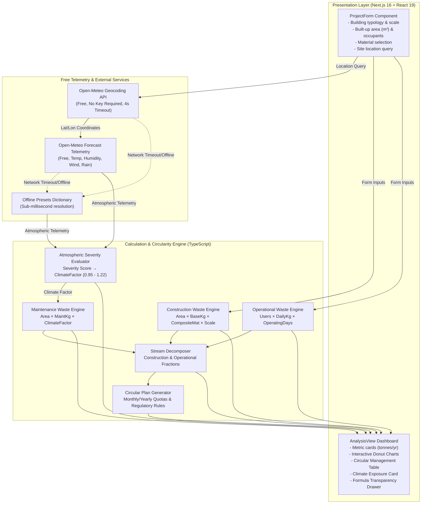

# WASTE//LOOP

<div align="center">

```
 __      __      _____  ___________ _____ // _      ____   ____  _____  
/  \    /  \    /  _  \ \__    ___//  ___/// \    /    \ /  _ \ \__   \ 
\   \/\/   /   /  /_\  \  |    |   \___  \  | |   /  |  \\  <_> ) |    / 
 \        /   /    |    \ |    |   /___  >  | |  /   |   \\____/  |    /  
  \__/\  /____\____|__  / |____|  /______/  \_/  \___|   /        |____\  
       \/             \/                              \_/                 
```

### **Free & Open-Source Architectural Waste Intelligence Platform**

*Empowering architects, structural engineers, sustainability consultants, researchers, and students with empirical waste estimation, real-time climate weathering telemetry, and circular diversion roadmaps.*

[](#-100-free--open-for-everyone)
[](#live-microclimate-weathering-engine)
[](LICENSE)
[](https://nextjs.org/)
[](https://react.dev/)
[](https://www.typescriptlang.org/)

[🌟 Why It's Free](#-100-free--open-for-everyone) • [Key Capabilities](#key-capabilities) • [Methodology & Formulas](#calculation-methodology) • [Quickstart](#getting-started) • [Architecture](#system-architecture) • [License](#license)

</div>

---

## 🌟 100% Free & Open for Everyone

**WASTE//LOOP is completely free and accessible to anyone, anywhere in the world.**

Whether you are an architect designing a high-rise, an ESG consultant auditing a project, a university student studying sustainable architecture, a civil contractor planning site segregation, or a green building researcher — this platform is made for you:

- 🔓 **Zero Paywalls & No Subscription Tiers**: Every single feature, calculation, stream breakdown, and report is 100% unrestricted.
- 🔑 **No API Keys or Accounts Required**: The climate telemetry connects directly to public, keyless Open-Meteo endpoints. You don't need to sign up, provide credit cards, or configure secrets.
- 🏢 **Free for Commercial & Non-Commercial Projects**: Released under the permissive **MIT License**, allowing individuals, design studios, and enterprises to use, fork, adapt, embed, and deploy it freely.
- 🌐 **Runs Anywhere**: Run it locally in seconds, host it on Vercel/Netlify for free, or containerize it for your internal infrastructure.

---

## Executive Overview

**WASTE//LOOP** is a high-precision environmental engineering tool designed to quantify, decompose, and optimize waste streams across the complete lifecycle of the built environment. 

Traditional building waste calculations rely on generic thumb rules that overlook building typologies, composite material choices, occupant densities, and geographic weathering effects. **WASTE//LOOP** unifies:

1. **Embodied Construction Waste Modeling** driven by structural typologies, dimensional scales, and composite material compositions.
2. **Operational Waste Modeling** calibrated to occupant volume and facility operational schedules.
3. **Climate-Accelerated Maintenance Degradation** powered by live atmospheric telemetry (temperature, relative humidity, wind speed, and precipitation).
4. **Circular Economy Diversion Strategy** mapping raw waste output to regulatory-compliant salvage, recycling, and reprocessing pipelines.

---

## Key Capabilities

- **Multi-Vector Structural Modeling**
  - Configurable across 6 building typologies: *Residential, Commercial Office, Retail/Commercial, Institutional/School, Healthcare/Hospital, and Hospitality/Hotel*.
  - Discrete scale calibration: *Small (≤5k m²), Medium (5k–20k m²), Large (20k–50k m²), and Very Large (50k+ m²)*.
  - Multi-select structural and finishing material profiles (*RCC Concrete, Brick/Masonry, Structural Steel, Architectural Glass, Timber, Gypsum/Drywall*).

- **Live Microclimate Weathering Engine**
  - Direct integration with the Open-Meteo Geocoding & Weather Telemetry API (zero-configuration, keyless).
  - Real-time resolution of ambient temperature ($^\circ\text{C}$), relative humidity ($\%RH$), surface wind speed ($\text{km/h}$), and daily precipitation ($\text{mm/day}$).
  - Resilient offline fallback dictionary for major global metropolitan centers (*Chennai, Bengaluru, Mumbai, Delhi, London, New York, Singapore, Dubai*).
  - Atmospheric severity scoring yielding a degradation modifier from **Low (-5%)** to **Severe (+22%)**, capturing tropical moisture saturation, UV thermal expansion, and salt/dust particulate abrasion.

- **Granular Stream Segregation & Visualization**
  - **Construction Streams**: Concrete/rubble, Brick/masonry, Wood/packaging, Metal scrap, Glass/gypsum, and Mixed/RDF.
  - **Operational Streams**: Organic/food waste, Paper/cardboard, Recyclable polymers, Glass/metal, and Residual landfill fractions.
  - Interactive SVG donut charts with contextual hover callouts, mass distribution breakdowns, and tonnage quantification.

- **Circular Management Plan & Regulatory Guidance**
  - Categorized segregation procedures with monthly and annual tonnage allocations.
  - Explicit compliance notes referencing national and international benchmarks (e.g., C&D Waste Management Rules, IS 383 recycled aggregates, Solid Waste Management Rules, and On-site Organic Waste Composting).

- **Calculation Transparency & Auditability**
  - Expandable formula audit drawer presenting step-by-step arithmetic, baseline constants, material weighting coefficients, and climate multipliers.
  - Formatted for direct integration into LEED, BREEAM, and IGBC green building submission dossiers.

---

## System Architecture



---

## Calculation Methodology

All calculations follow empirical engineering benchmarks calibrated to global green building standards:

### 1. Construction Embodied Waste
$$W_{\text{construction}} = A \times \beta_{\text{type}} \times \left( \frac{1}{N} \sum_{i=1}^{N} \mu_i \right) \times \sigma_{\text{scale}}$$

Where:
- $A$: Total Gross Built-up Area ($\text{m}^2$)
- $\beta_{\text{type}}$: Base construction waste generation factor ($\text{kg/m}^2$)
- $\mu_i$: Specific material variance factor for each selected material
- $\sigma_{\text{scale}}$: Dimensional scale multiplier

### 2. Operational Waste (Annual)
$$W_{\text{operational}} = U \times \omega_{\text{type}} \times D_{\text{annual}}$$

Where:
- $U$: Total building occupant load / daily users
- $\omega_{\text{type}}$: Per-capita occupant waste generation index ($\text{kg/occupant/day}$)
- $D_{\text{annual}}$: Facility operating schedule ($365 \text{ days/year}$)

### 3. Maintenance Waste (Climate-Adjusted Annual)
$$W_{\text{maintenance}} = A \times \gamma_{\text{type}} \times \Phi_{\text{climate}}$$

Where:
- $\gamma_{\text{type}}$: Baseline annual maintenance turnover factor ($\text{kg/m}^2/\text{year}$)
- $\Phi_{\text{climate}}$: Atmospheric weathering modifier derived from the severity matrix below:

| Severity Score Range | Exposure Level | Climate Modifier ($\Phi_{\text{climate}}$) | Weathering Characterization |
| :--- | :--- | :---: | :--- |
| **Score $\ge 5.5$** | **Severe** | **$1.22$** | Severe tropical / coastal weathering (+22% degradation) |
| **$3.5 \le \text{Score} < 5.5$** | **High** | **$1.12$** | High exposure (+12% maintenance cycle acceleration) |
| **$1.5 \le \text{Score} < 3.5$** | **Moderate** | **$1.04$** | Moderate exposure (+4% nominal buffer) |
| **Score $< 1.5$** | **Low** | **$0.95$** | Benign / temperate conditions (-5% weathering discount) |

Severity score points are aggregated dynamically based on:
- **Relative Humidity**: $>80\% \ (+2.0)$, $>65\% \ (+1.2)$, $<25\% \ (+0.8\text{ dry dust abrasion})$
- **Precipitation**: $>8\text{ mm/day} \ (+2.5)$, $>3\text{ mm/day} \ (+1.5)$, $>0.5\text{ mm/day} \ (+0.5)$
- **Thermal Stress**: $>34^\circ\text{C}$ or $<0^\circ\text{C} \ (+2.0)$, $>28^\circ\text{C}$ or $<8^\circ\text{C} \ (+1.0)$
- **Wind Buffeting**: $>25\text{ km/h} \ (+1.5)$, $>15\text{ km/h} \ (+0.8)$

---

## Empirical Benchmark Factors

### Typology Matrix

| Building Typology | Construction Base ($\text{kg/m}^2$) | Occupant Load ($\text{kg/user/day}$) | Base Maintenance ($\text{kg/m}^2/\text{year}$) | Primary Operational Characteristics |
| :--- | :---: | :---: | :---: | :--- |
| **Residential** | $55.0$ | $0.45$ | $1.5$ | High domestic organics, mixed dry packaging |
| **Commercial Office** | $65.0$ | $0.30$ | $2.0$ | High paper, cardboard, and composite recyclables |
| **Retail / Commercial** | $70.0$ | $0.50$ | $2.5$ | Heavy packaging cartons, plastic wraps, and retail prep |
| **Institutional / School** | $55.0$ | $0.25$ | $1.8$ | Paper, cafeteria food scraps, educational supplies |
| **Healthcare / Hospital** | $75.0$ | $1.20$ | $3.0$ | High single-use consumables, clinical packaging |
| **Hospitality / Hotel** | $70.0$ | $0.80$ | $2.6$ | Intense food waste, amenities packaging, beverage glass |

### Material Variance Coefficients

| Material Category | Factor ($\mu$) | Circular Economy Pathway |
| :--- | :---: | :--- |
| **RCC / Concrete** | $1.00$ | Crushed on-site for granular sub-base & certified recycled aggregates (IS 383) |
| **Brick / Masonry** | $1.08$ | Brick deconstruction, whole brick reclamation, or paving sub-grade filler |
| **Structural Steel** | $0.90$ | High circularity scrap loop; direct dispatch to electric arc furnace foundries |
| **Architectural Glass** | $0.95$ | Cullet reprocessing for glass containers or foam glass insulation |
| **Timber** | $0.85$ | Formwork reconditioning, pallet manufacturing, or certified biomass |
| **Gypsum / Drywall** | $1.12$ | Offcut segregation for closed-loop plasterboard remanufacturing |

---

## Regulatory & ESG Alignment

- **LEED v4.1 / v5 (USGBC)**: Fulfills requirements for *Construction & Demolition Waste Management* (up to 2 points) and *Operational Waste Reduction*.
- **BREEAM**: Complies with *Wst 01 Construction waste management* and *Wst 03 Operational waste*.
- **IGBC / GRIHA**: Fulfills *Mandatory Waste Reduction on Construction Sites* and *Solid Waste Management Rules*.
- **IS 383**: Directs concrete demolition fractions into coarse and fine recycled aggregates.

---

## Project Structure

```
Waste/
├── public/                       # Static public assets and favicons
├── src/
│   ├── app/
│   │   ├── globals.css           # Design tokens, typography, glassmorphism utilities
│   │   ├── layout.tsx            # Global HTML document shell with SEO meta tags
│   │   └── page.tsx              # Root reactive state machine & coordinator
│   ├── components/
│   │   ├── analysis/
│   │   │   ├── analysis-view.tsx            # Results dashboard coordinator
│   │   │   ├── calculation-transparency.tsx # Audit drawer detailing exact arithmetic
│   │   │   ├── climate-card.tsx             # Real-time weather & exposure gauge
│   │   │   ├── donut-chart.tsx              # Pure SVG responsive circular charts
│   │   │   ├── empty-state.tsx              # Stepped progress indicator during queries
│   │   │   ├── management-table.tsx         # Segregated circular diversion roadmap
│   │   │   ├── metric-card.tsx              # High-contrast KPI metric cards
│   │   │   └── waste-streams.tsx            # Tabbed stream decomposition breakdown
│   │   ├── calculator/
│   │   │   └── project-form.tsx             # Form controls with real-time feedback
│   │   ├── layout/
│   │   │   ├── header.tsx                   # Sticky glass header with branding & status
│   │   │   └── page-shell.tsx               # Centered 1440px viewport container
│   │   └── ui/                              # Base UI primitives
│   └── lib/
│       ├── calculator/
│       │   ├── climate.ts        # Weather severity scoring logic
│       │   ├── construction.ts   # Embodied construction waste calculations
│       │   ├── factors.ts        # Typology, scale, and material benchmarks
│       │   ├── index.ts          # Core calculator interface and exports
│       │   ├── maintenance.ts    # Climate-adjusted maintenance formulas
│       │   ├── management-plan.ts# Circular action plan generator
│       │   ├── operational.ts    # Occupancy operational waste formulas
│       │   ├── types.ts          # TypeScript domain definitions
│       │   └── waste-streams.ts  # Construction & operational stream weighting
│       ├── services/
│       │   └── climate.ts        # Open-Meteo geocoding & telemetry client
│       └── utils.ts              # ClassName merge utilities (clsx + tailwind-merge)
├── LICENSE                       # Official open-source MIT License
├── package.json                  # Dependencies and execution scripts
├── tsconfig.json                 # TypeScript strict compiler configuration
└── README.md                     # Comprehensive project documentation
```

---

## Getting Started

### Prerequisites

Ensure you have installed:
- **Node.js**: `v18.18.0` or higher (Node 20+ recommended)
- **Package Manager**: `npm`, `pnpm`, `yarn`, or `bun`

### Quick Setup

```bash
# 1. Clone the repository (Free for anyone)
git clone https://github.com/Gokulakrishnxn/Waste-loop.git
cd Waste-loop

# 2. Install dependencies
npm install

# 3. Start local development server
npm run dev

# 4. Open in browser
# Visit http://localhost:3000
```

### Production Build & Linting

```bash
# Run ESLint validation (clean, 0 warnings/errors)
npm run lint

# Build optimized production bundle
npm run build

# Start production server
npm run start
```

---

## License

This project is licensed under the **MIT License** — a permissive open-source license that allows **anyone to use, modify, distribute, or incorporate this software freely for both commercial and non-commercial purposes**.

See the full [LICENSE](LICENSE) file for details.

---

<div align="center">
  <sub><strong>WASTE//LOOP</strong> is 100% Free and Open Source. Created for architects, engineers, students, and sustainability advocates worldwide.</sub>
</div>
